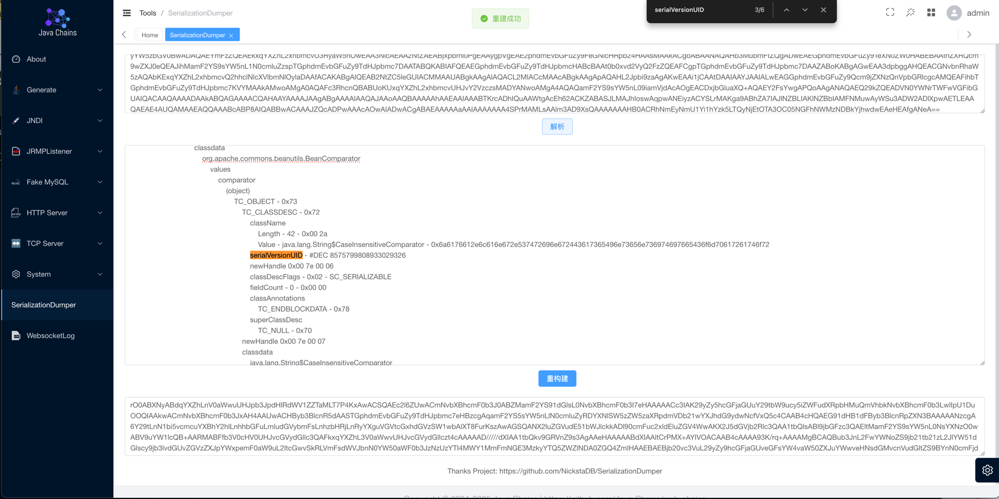

<h4 align="right">中文 | <strong><a href="./en/README_EN.md">English</a></strong> </h4>
<h1 align="center">Web Chains</h1>
<div align="center">


<div align="center">
    
</div>
</div>

`Web-Chains`/`Java-Chains` 是一个 Java Payload 生成与漏洞利用 Web 平台，便于广大安全研究员快速生成 Java Payload，以及对
JNDI 注入、MySQL JDBC 反序列化、JRMP 反序列化等漏洞进行方便快速测试，能够在一定程度上提高测试效率。

> 我们站在巨人肩膀上，致力于打造最强的 Java 安全研究领域的瑞士军刀

<p align="center">
  
</p>

## 模块介绍

`Web-Chains` 含有以下六大模块

### 生成模块(Generate)

`JavaNativePayload`: Java 反序列化原生 Payload 生成

`HessianPayload`: Hessian1 反序列化 Payload 生成，并支持 HessianServlet 格式反序列化数据

`Hessian2Payload`: Hessian2 反序列化 Payload 生成

`ShiroPayload`: Shiro Payload 生成，在某些特殊环境下方便手动进行生成与测试
 - 支持自定义 AES KEY
 - 支持 AES GCM 模式
 - 支持插入 Base64 混淆字符

`OtherPayload`
- `CharsetJarConvet`: 生成 charsets.jar 包，适用于 SpringBoot 下文件上传 RCE 场景
- `GroovyJarConvert`: 生成 fastjson-groovy.jar 包，适用于 Fastjson 高版本下通过 Groovy 链加载特定格式 Jar 包实现 RCE）
- `SnakeyamlJarConvert`: 生成 snakeyaml.jar 包，适用于 SnakeYaml 通过 SPI 加载特定格式 Jar 包实现 RCE

- `JDBCPayload`: JDBC Payload 生成
  - H2 JDBC
  - PostgresSQL
  - ...

`ExpressionPayload`: 表达式 Payload 生成，本质上是将表达式加载字节码模板中的字节码部分进行替换，推荐手动实现
- `BcelConvert`: BCEL 格式字节码生成
- `JsConvert`: Oracle Nashorn JS 表达式加载字节码
- `VelocityConvert`: Velocity 通过 bcel 来加载字节码
- ...

`BytecodePayload`: 字节码生成
  - 例如可生成执行命令字节码、Sleep字节码、DNSLog字节码，注入内存马字节码，回显字节码、中间件探测字节码、写文件字节码、下载文件字节码
  - 支持自定义字节码版本
  - 支持自定义字节码类名
  - 支持生成 TemplatesImpl 字节码格式 - 实现 AbstractTranslet 接口
  - 支持使用 Class-Obf 进行字节码混淆

`XStreamPayload`: XStream 数据生成，暂未全面测试，部分Payload无法使用

---

本平台生成的 Payload 支持的一些混淆情况如下：

|                       | JavaNativePayload | HessianPayload | Hessian2Payload |
|-----------------------| ----------------- | -------------- | --------------- |
| 随机集合脏数据填充             | ✅                 | ✅              | ✅               |
| 垃圾类填充                 | ✅                 | ✅              | ✅               |
| UTF-8 Overlong Encoding | ✅                 | ✅              | ✅               |
| TC_RESET 填充           | ✅                 | ❌              | ❌               |

---

注：若想通过 UserCustomByteArrayFromXXX 提供自定义的Java序列化字节流数据来进行混淆，那么目前暂不支持使用随机集合与垃圾类插入混淆，这与混淆的实现有关，具体支持情况如下：

|                         | JavaNativePayload(自定义序列化场景) |
| ----------------------- | ----------------------------------- |
| 随机集合混淆            | ❌                                   |
| 垃圾类插入              | ❌                                   |
| UTF-8 Overlong Encoding | ✅                                   |
| TC_RESET 填充           | ✅                                   |

### JNDI 注入利用模块 (JNDI)

支持六种利用姿势，外加一个便于一键测试常见链的 ShowHand 链

`JndiBasicPayload`: LDAP 远程加载字节码

`JndiDeserializationPayload`: LDAP 中基于 javaSerializedData 字段实现的反序列化

`JndiResourceRefPayload`: LDAP 基于 BeanFactory 的 Tomcat EL、Groovy等利用

`JndiReferencePayload`: LDAP 基于其他 ObjectFactory 的Reference利用，例如各种DataSource JDBC利用

`JndiRMIDeserializePayload`: LDAP 高版本 JDK 绕过之RMI反序列化

`JndiRefBypassPayload`: LDAP 高版本 JDK 绕过之ReferenceBypass

`JndiShowHandPayload`: JNDI梭哈链，一键测试常规利用链，提高测试效率

### Mysql JDBC 反序列化利用模块 (Fake MySQL)

`FakeMysqlPayload`: 经典 MySQL JDBC 反序列化利用姿势

`FakeMysqlShowHandPayload`: FakeMySQL梭哈链，一键测试常规反序列化链，提高测试效率

### JRMP 反序列化利用模块 (JRMPListener)

可配合 JRMPClient 反序列化链实现RMI低版本的绕过

### TCP Server

一个简易的 TCP Server，可以将生成的Payload文件挂载到TCP端口服务上，访问该端口即可返回指定内容

适用于 Derby 反序列化 RCE 场景，可直接通过tcp端口获取反序列化数据

### HTTP Server

一个简易的HTTP服务器，将生成的Payload文件挂载到HTTP端口服务上，访问指定端口即可返回指定内容

适用于 postgresql 远程加载 SpringBeanXML 文件等场景


### 小工具(Tools)

底层调用了 SerializationDumper，能够解析序列化数据，并能实现手动更改类的 serialVersionUID 字段



## 快速开始

**特别注意：我们默认只对 8011 端口进行了随机密码的登陆保护。其他端口可能存在被反制的风险，使用完相关功能后记得及时关闭相应端口
**

### 方式一：Docker

你可以通过 `docker` 一条命令启动 `web-chains` 项目（这也是推荐做法）

```shell
docker run -d \
  --name web-chains \
  --restart=always \
  -p 8011:8011 \
  -p 58080:58080 \
  -p 50389:50389 \
  -p 50388:50388 \
  -p 13999:13999 \
  -p 3308:3308 \
  -p 11527:11527 \
  -p 50000:50000 \
  -e CHAINS_AUTH=true \
  -e CHAINS_PASS= \
  javachains/webchains:1.3.0
```

可通过环境变量配置鉴权或密码；

**CHAINS_AUTH**: true为开启鉴权，false为关闭鉴权，默认开启鉴权

**CHAINS_PASS**: 指定web密码，若该变量为空则随机生成密码，默认随机生成密码

备注：生成功能仅使用 `8011` 端口即可，其他端口为 `exploit` 模块使用

使用以下命令从docker中获取随机生成的强密码

```shell
docker logs $(docker ps | grep javachains/webchains | awk '{print $1}') | grep -E 'password'
```

输出示例

```text
11-12 06:59:53.301 INFO  [main] c.a.c.w.c.SecurityConfig       |  | password: XSsWerJFGcCjB8FU
```

登录页面：`http://your-ip:8011`

### 方式二：Jar包启动

⚠️仅支持 JDK8，推荐使用 Temurin8/Zulu8 JDK

使用 `java -jar web-chains.jar` 即可启动，每次启动后会打印出随机生成的密码

默认监听 0.0.0.0 ，登录页面：`http://your-ip:8011` （使用这里的用户名密码登录）

可通过环境变量设置web登录密码，例如：

Linux：

```bash
export CHAINS_PASS=[your_password] && java -jar web-chains.jar
```

Windows：

```cmd
set CHAINS_PASS=[your_password] && java -jar web-chains.jar
```

## 详细使用

详细使用文档：https://www.yuque.com/shenjingwa-leuvd/wpqdhf/eekyvau9fcblzzt0

## 其他

本工具的优势：

1. 相较于命令行的各种工具，Web 界面上的操作更加简单易用，能够在很方便的生成 JNDI 注入、MySQL JDBC 等测试 Payload
2. 将各种 Payload 进行解耦与复用，前端动态渲染参数输入框，方便拓展与维护
3. 搜集整理并覆盖了较为全面的 Java、Hessian 等反序列化 Payload，集成了各种小 trick 以及混淆等姿势

劣势（同时也是待改进的点）：

1. 生成的某些冷门 Payload 组合无法正常使用。由于解耦会导致组合的复杂度上升，并且目前无法覆盖测试所有 Payload
   组合。针对该情况，目前的缓解措施是通过 Payload 输出框上方的有个下拉选项【预设链】，提供了测试好的链子组合，可以提供一些参考。
   生成冷门 Payload 组合建议提前测试一下，若发现无法正常运行的 Payload 可以提交 Issues 反馈
2. 由于需要各种依赖去生成Payload，所以项目的 jar 包的体积较大 (200+MB)
3. 比较冷门的以及实战价值比较低的 Payload 暂未集成

常见问题：

问：为什么用 Web，而不是 Java GUI？

答：各有优势，但是我认为 Web 适用场景较广，主要是很方便的在服务器上操作生成 JNDI 注入等 Payload

## 更新内容

[CHANGELOG.md](./CHANGELOG.md)

## 参考和致谢

仅支持个人研究学习，切勿用于非法犯罪活动。

本项目的开发者、提供者和维护者不对使用者使用工具的行为和后果负责，工具的使用者应自行承担风险。

参考致谢：

- https://github.com/wh1t3p1g/ysomap
- https://github.com/qi4L/JYso
- https://github.com/X1r0z/JNDIMap
- https://github.com/Whoopsunix/PPPYSO
- https://github.com/jar-analyzer/class-obf
- https://github.com/4ra1n/mysql-fake-server
- https://github.com/jar-analyzer/class-obf
- https://github.com/mbechler/marshalsec
- https://github.com/frohoff/ysoserial
- https://github.com/H4cking2theGate/ysogate
- https://github.com/Bl0omZ/JNDIEXP
- https://github.com/kezibei/Urldns
- https://github.com/rebeyond/JNDInjector
- https://github.dev/LxxxSec/CTF-Java-Gadget
- https://github.com/pen4uin/java-memshell-generator
- https://github.com/pen4uin/java-echo-generator
- https://github.com/NickstaDB/SerializationDumper
- https://xz.aliyun.com/t/5381
- http://rui0.cn/archives/1408

## Star History

[](https://star-history.com/#java-chains/web-chains&Date)
